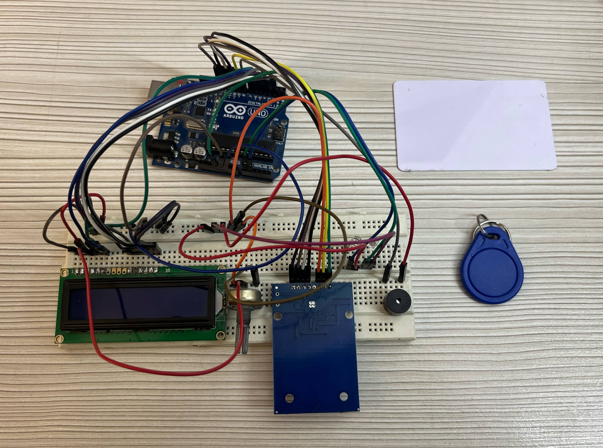
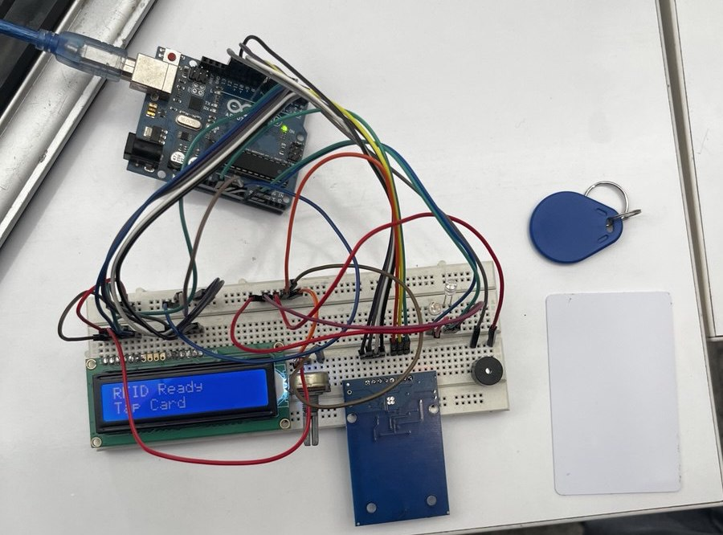

# RFID Access Control System

---

## Project Overview

This project implements an RFID-based access control system using an Arduino microcontroller and the MFRC522 RFID reader.  
The system reads the UID of an RFID card and compares it with a predefined authorized UID.  
If the card is valid, access is granted, and visual indicators are activated.

---

## Hardware Setup

---

## Components Used

- Arduino Uno
- MFRC522 RFID Module
- LCD 16x2 Display
- LEDs
- Buzzer
- Resistors
- RFID Card / Tag

---

## Source Code

Arduino program used in this project:

`code/rfid_access_control.ino`

---

## Demonstration

---

## Documentation

Detailed project reports:

- Hardware Report → docs/hardware_report.pdf
- Software Report → docs/software_report.pdf

---

## Academic Information

This project was developed as part of the **Hardware Systems Laboratory** course.

**Instructor:**  
Dr. Fardine Ghavidel
